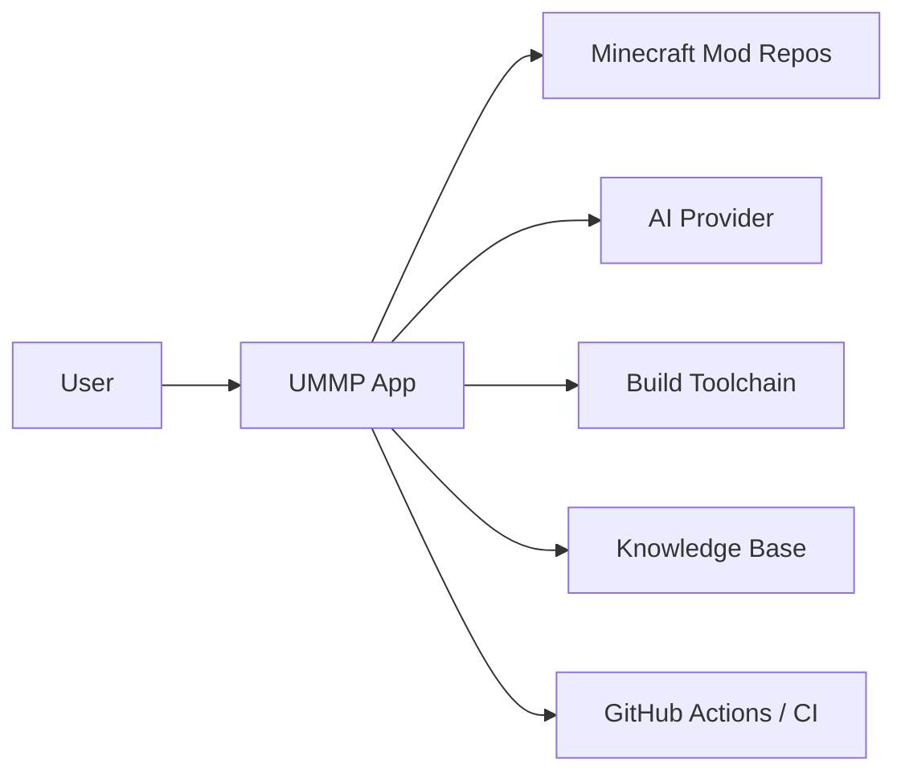
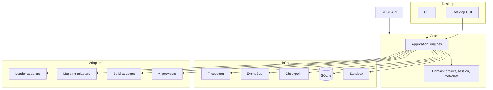
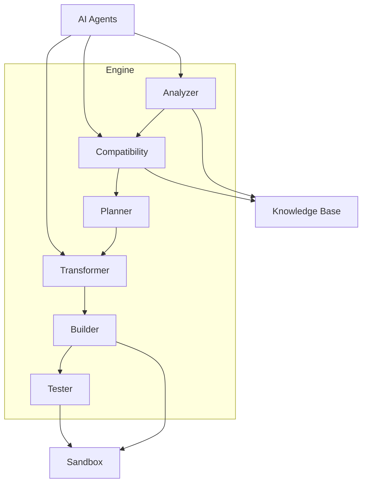
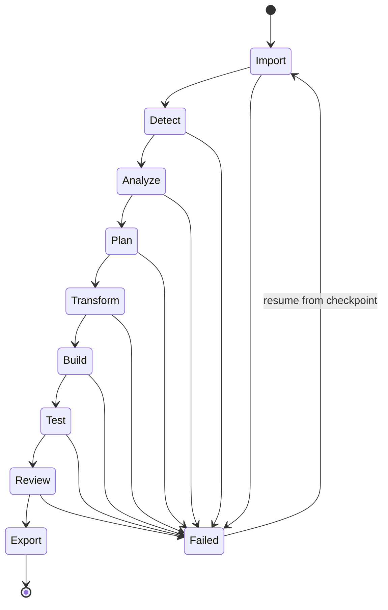
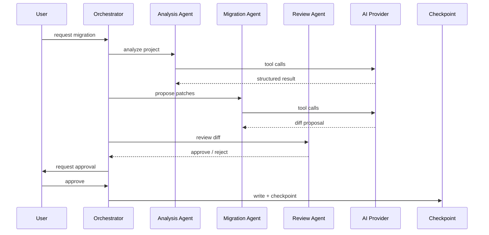
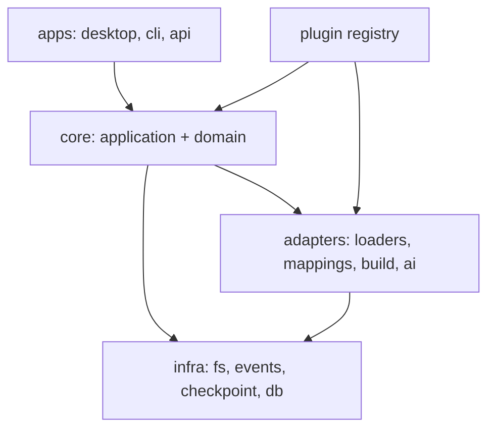

# Architecture Diagrams (Mermaid)

## System Context

```mermaid
graph LR
    U[User] --> UMMP[UMMP App]
    UMMP --> MC[Minecraft Mod Repos]
    UMMP --> AI[AI Provider]
    UMMP --> BT[Build Toolchain]
    UMMP --> KB[Knowledge Base]
    UMMP --> GH[GitHub Actions / CI]
```

## Container

```mermaid
graph TB
    subgraph Desktop
        GUI[Desktop GUI]
        CLI[CLI]
    end
    API[REST API] --> Core
    subgraph Core
        App[Application: engines]
        Dom[Domain: project, session, metadata]
    end
    subgraph Infra
        FS[Filesystem]
        EB[Event Bus]
        CK[Checkpoint]
        DB[(SQLite)]
        SAN[Sandbox]
    end
    subgraph Adapters
        L[Loader adapters]
        M[Mapping adapters]
        B[Build adapters]
        P[AI providers]
    end
    GUI --> App
    CLI --> App
    App --> Dom
    App --> FS
    App --> EB
    App --> CK
    App --> DB
    App --> SAN
    App --> L
    App --> M
    App --> B
    App --> P
```

## Component

```mermaid
graph TD
    subgraph Engine
        AN[Analyzer] --> COMP[Compatibility]
        COMP --> PLAN[Planner]
        PLAN --> XF[Transformer]
        XF --> BL[Builder]
        BL --> TE[Tester]
    end
    AN --> KB[Knowledge Base]
    COMP --> KB
    BL --> SAN[Sandbox]
    TE --> SAN
    AI[AI Agents] --> AN
    AI --> XF
    AI --> COMP
```

## Migration Pipeline

```mermaid
stateDiagram-v2
    [*] --> Import
    Import --> Detect
    Detect --> Analyze
    Analyze --> Plan
    Plan --> Transform
    Transform --> Build
    Build --> Test
    Test --> Review
    Review --> Export
    Export --> [*]
    Import --> Failed
    Detect --> Failed
    Analyze --> Failed
    Plan --> Failed
    Transform --> Failed
    Build --> Failed
    Test --> Failed
    Review --> Failed
    Failed --> Import: resume from checkpoint
```

## AI Agent Interaction

```mermaid
sequenceDiagram
    participant U as User
    participant O as Orchestrator
    participant A as Analysis Agent
    participant M as Migration Agent
    participant R as Review Agent
    participant P as AI Provider
    participant CK as Checkpoint
    U->>O: request migration
    O->>A: analyze project
    A->>P: tool calls
    P-->>A: structured result
    O->>M: propose patches
    M->>P: tool calls
    P-->>M: diff proposal
    O->>R: review diff
    R-->>O: approve / reject
    O->>U: request approval
    U->>O: approve
    O->>CK: write + checkpoint
```

## Module Dependency

```mermaid
graph TD
    apps[apps: desktop, cli, api] --> core[core: application + domain]
    core --> infra[infra: fs, events, checkpoint, db]
    core --> adapt[adapters: loaders, mappings, build, ai]
    adapt --> infra
    plugins[plugin registry] --> core
    plugins --> adapt
```